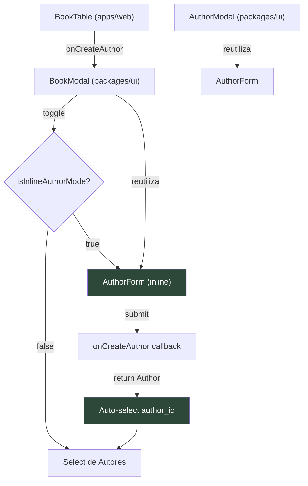

# Criação Inline de Autor no Modal de Livro

Permitir a criação de autores diretamente dentro do `BookModal`, eliminando a fricção de sair do fluxo de criação de livro para cadastrar um autor.

## User Review Required

> [!IMPORTANT]
> **Decisão de UX**: Após criar o autor inline, o formulário retorna automaticamente ao modo de seleção (`Select`) com o novo autor já selecionado. Confirme se esse é o comportamento desejado ou se prefere manter o formulário inline visível.

> [!IMPORTANT]
> **Escopo do AuthorForm**: O formulário de autor será extraído como componente reutilizável no `@library/ui`. Ele será usado tanto no `AuthorModal` (existente) quanto no `BookModal` (novo, inline). Isso evita duplicação de lógica de campos e validação.

## Proposed Changes

### Componente `AuthorForm` (novo, reutilizável)

Extrair os campos `name` e `email` do `AuthorModal` em um componente `AuthorForm` independente, para reutilização.

#### [NEW] [AuthorForm.tsx](file:///c:/Users/victo/Desktop/Dev/library/packages/ui/src/AuthorForm/AuthorForm.tsx)

- Componente `AuthorForm` com props:
  - `form: FormInstance<AuthorPayload>` — instância do form Ant Design (controlada externamente)
  - `disabled?: boolean` — para modo view
- Contém apenas os `Form.Item` de `name` e `email` com suas regras de validação
- **Não** encapsula `<Form>` — apenas renderiza os itens, para que o componente pai controle o form

```tsx
// Exemplo da API:
<Form form={authorForm} layout="vertical">
  <AuthorForm form={authorForm} />
</Form>
```

---

### Refatoração do `AuthorModal`

#### [MODIFY] [AuthorModal.tsx](file:///c:/Users/victo/Desktop/Dev/library/packages/ui/src/AuthorModal/AuthorModal.tsx)

- Substituir os `Form.Item` inline pelo novo `<AuthorForm />`
- Manter toda a lógica de modal (open/close, submit, view mode) inalterada
- Mudança puramente estrutural — comportamento idêntico

---

### Modificação do `BookModal` (feature principal)

#### [MODIFY] [BookModal.tsx](file:///c:/Users/victo/Desktop/Dev/library/packages/ui/src/BookModal/BookModal.tsx)

**Novas props:**
```ts
export interface BookModalProps {
  // ... props existentes ...
  onCreateAuthor?: (values: AuthorPayload) => Promise<Author>  // NOVO
  isCreatingAuthor?: boolean  // NOVO — loading state
}
```

**Estado interno:**
```ts
const [isInlineAuthorMode, setIsInlineAuthorMode] = useState(false)
const [authorForm] = Form.useForm<AuthorPayload>()
```

**Fluxo no formulário (modo create/edit):**

1. **Modo Seleção (padrão)**: `Select` de autores + botão "Criar novo autor" ao lado
2. **Modo Criação Inline**: `Select` é substituído pelo `<AuthorForm />` + botão "Cancelar"
3. Ao salvar o autor inline:
   - Chama `onCreateAuthor(authorPayload)`
   - Recebe o `Author` criado de volta
   - Seta `form.setFieldValue('author_id', newAuthor.id)` no form do livro
   - Volta ao modo seleção
4. Reseta `isInlineAuthorMode` quando o modal fecha

**Layout visual do campo Autor:**

```
┌─────────────────────────────────────────┐
│  Autor *                                │
│  ┌──────────────────────┐ ┌───────────┐ │
│  │ Selecione um autor ▾ │ │ + Criar   │ │
│  └──────────────────────┘ └───────────┘ │
└─────────────────────────────────────────┘

  ↓ (ao clicar "Criar")

┌─────────────────────────────────────────┐
│  Novo Autor              ┌───────────┐  │
│                          │ Cancelar  │  │
│  ┌─────────────────────────────────┐    │
│  │ Nome *: [________________]      │    │
│  │ Email:  [________________]      │    │
│  │              [Salvar Autor]     │    │
│  └─────────────────────────────────┘    │
└─────────────────────────────────────────┘
```

---

### Wiring no `BookTable` (conectar callbacks)

#### [MODIFY] [BookTable.tsx](file:///c:/Users/victo/Desktop/Dev/library/apps/web/src/components/books/BookTable.tsx)

- Importar `useCreateAuthor` do hook `useAuthors`
- Criar handler `handleCreateAuthor`:
  ```ts
  const handleCreateAuthor = async (payload: AuthorPayload): Promise<Author> => {
    const author = await createAuthor.mutateAsync(payload)
    return author
  }
  ```
- Passar `onCreateAuthor` e `isCreatingAuthor` como props para `<BookModal />`

---

### Exportação do novo componente

#### [MODIFY] [index.ts](file:///c:/Users/victo/Desktop/Dev/library/packages/ui/src/index.ts)

- Adicionar export do `AuthorForm` e seu tipo `AuthorFormProps`

---

## Arquitetura das alterações



## Arquivos Impactados (resumo)

| Arquivo | Ação | Pacote |
|---------|------|--------|
| `AuthorForm/AuthorForm.tsx` | **NOVO** | `@library/ui` |
| `AuthorModal.tsx` | Refatorar para usar `AuthorForm` | `@library/ui` |
| `BookModal.tsx` | Adicionar toggle + inline form | `@library/ui` |
| `index.ts` (ui) | Exportar `AuthorForm` | `@library/ui` |
| `BookTable.tsx` | Wiring do `onCreateAuthor` | `apps/web` |

## Open Questions

> [!IMPORTANT]
> 1. **UX pós-criação**: Após criar o autor inline, voltar automaticamente ao `Select` com o autor selecionado? Ou manter o formulário inline visível com uma mensagem de sucesso?
> 2. **Mensagem de feedback**: Deseja exibir uma notificação (toast) de sucesso ao criar o autor inline, ou basta a auto-seleção no select ser o feedback visual?

## Verification Plan

### Automated Tests
- Build do monorepo: `npm run build` na raiz
- Verificação de tipos: `npx tsc --noEmit` nos pacotes `@library/ui` e `apps/web`

### Manual Verification
- Abrir o modal de livro → verificar que o `Select` de autores aparece normalmente
- Clicar em "Criar novo autor" → verificar que o formulário inline aparece
- Preencher nome/email → clicar "Salvar Autor" → verificar que:
  - O autor é persistido no IndexedDB
  - O select reaparece com o novo autor selecionado
  - A lista de autores é atualizada
- Clicar "Cancelar" no modo inline → verificar que volta ao select sem efeitos colaterais
- Submeter o livro com o autor recém-criado → verificar persistência completa
- Testar com o `AuthorModal` independente → verificar que continua funcionando normalmente